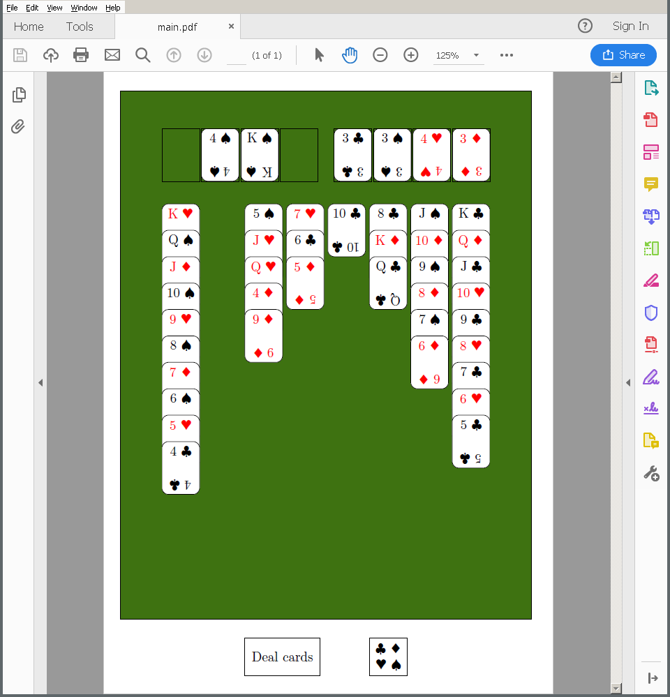

# SoliTex
This is a Solitaire game (FreeCell to be exact), implemented in Latex and playable in a PDF viewer. Currently it only runs in Adobe Reader. On Linux in can be used through Wine.

Features:

- Select number of suits (1, 2 or 4) at runtime
- Randomized card layout for every game
- Runs on laptops, but a desktop is recommended
- Sometimes, it does not crash your PDF viewer

## Download
Compiled PDFs can be downloaded from the [releases section](https://github.com/fllor/SoliTex/releases).

## Custom cards
The card design can be changed in `draw_cards.tex`.

## License
SoliTex is licensed under the GNU General Public License v3. 
